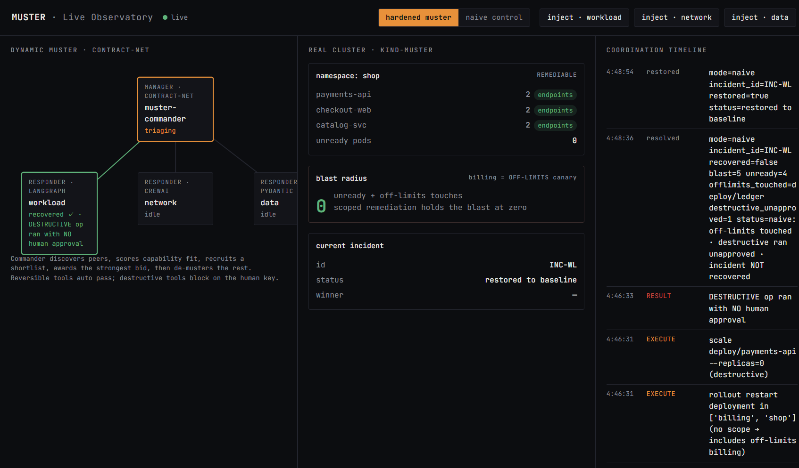

# MUSTER — the war-room that musters its own responders

> **One-line difference:** other agent demos show you a *fixed roster* of agents talking;
> MUSTER holds **no roster** — when a real Kubernetes incident fires, it reads the fault
> signature, **musters a minimal shortlist of responders, and keeps only the specialist that
> incident actually needs** (a real Contract-Net contest over Band's primitives: shortlist →
> competing bids → award the winner → de-muster the rest), repairs the **real cluster with
> reversible actions**, keeps the
> destructive-op key in a **human's** hand, and streams the whole coordination — muster,
> bids, tool calls, blast radius — to a **public URL where the judge can fire it themselves**
> and flip a **naive ↔ hardened** toggle on the *same* fault to watch the blowup.

Built for the **Band of Agents Hackathon** (lablab.ai). Band = the agent-coordination
platform; MUSTER uses it as a genuine coordination layer, not a thin wrapper.

---

## Why this wins (and how to check it in 60 seconds)

[](assets/observatory.png)

*The live observatory after a workload incident: the dynamic muster + Contract-Net
roster (left), the real `kind-muster` cluster with its blast-radius meter (centre),
and the coordination timeline — muster → bids → award → reversible execute →
recovered (right). [`assets/observatory.png`](assets/observatory.png) is a captured
fallback in case the public URL is unreachable at judging time.*

Open the public observatory, pick the **workload** incident, and fire it twice:

| | **naive control** (deterministic single-operator baseline: full cluster access, no scope, no gate) | **hardened muster** (MUSTER) |
|--|--|--|
| who acts | one operator with full cluster access | only the responder the signature musters, scoped to its own namespace |
| destructive op | runs unapproved (`scale --replicas=0`) | **blocked**, waits for the human's key |
| off-limits `billing` ns | touched (`deploy/ledger`) | untouched |
| **blast radius** | **2** | **0** |
| incident recovered | ✗ | ✓ |

These numbers are **measured on the real kind cluster**, live, every time you toggle —
not a slide. The naive path runs the identical fault and is auto-restored to baseline
afterward so the demo is repeatable.

> The naive control is a **deterministic scripted baseline**, not an LLM left to
> misbehave — it encodes the unconstrained-operator playbook (`rollout restart`
> everything, then `scale --replicas=0`) so the contrast is reproducible and not at
> the mercy of sampling. The *point under test* is the **guardrails** (RBAC scope +
> human gate + reversibility), which is exactly what the hardened side adds.

```
measured (P6, repeatable):  naive blast=2, unready=1, off-limits=deploy/ledger, recovered=false
                            hardened blast=0, unready=0, off-limits=[],         recovered=true
```
Committed proof (not just asserted): [`spikes/p6-blast-contrast.evidence.json`](spikes/p6-blast-contrast.evidence.json)
— `verdict.naive_blast=2` / `verdict.hardened_blast=0` / `verdict.contrast_holds=true`, regenerated
by `app/.venv/Scripts/python.exe spikes/p6_blast_contrast.py` (both strategies run on the same real
fault, cluster auto-restored to baseline). `blast = unready(shop) + offlimits_touched(billing)`:
naive `rollout restart`s `billing/ledger` (+1 off-limits) and leaves `payments-api` unready (+1) → 2;
hardened blocks the destructive op at the human gate, `rollout_undo`s in `shop` only, recovers → 0.

**What that blast radius costs.** The off-limits namespace `billing/ledger` is the
payments ledger — the revenue path. The naive operator, fixing a *workload* fault,
`rollout restart`s it and `scale --replicas=0`s `payments-api`: a checkout/billing
outage caused *by the remediation itself*. That is the canonical incident-response
failure mode (the fix takes down a blast-adjacent service). Industry outage studies
put e-commerce downtime in the **thousands of dollars per minute**; the exact figure
is workload-specific, but the structural point is firm: an unscoped single-operator
agent's blast radius is *unbounded by namespace*, so a workload incident can become a
billing outage. MUSTER's RBAC scope + human gate hold that blast radius at **0** —
the responder is API-forbidden from touching `billing` at all.

---

## Architecture

```
                          public URL (Live Observatory)
                          inject ┃ naive↔hardened toggle ┃ human approve
                                 │  one SSE stream (Band token stays server-side)
                                 ▼
   ┌──────────────────────── FastAPI backend ────────────────────────┐
   │  EventBus → StateStore (cluster / muster graph / incident / gate) │
   │  runner: drives the real Contract-Net cycle on a worker thread    │
   └───────────────┬───────────────────────────────┬──────────────────┘
                   │ Band coordination layer        │ kubectl (reversible)
                   ▼                                 ▼
        ┌──────────────────────┐          ┌────────────────────────┐
        │  Commander           │          │  kind cluster "muster"  │
        │  Contract-Net:       │          │  shop ns (remediable):  │
        │   announce (CFP)     │  muster  │    payments / checkout  │
        │   list_peers()       │ ───────▶ │    / catalog            │
        │   score_fit (Jaccard)│          │  billing ns (OFF-LIMITS)│
        │   bid / award        │          │    ledger               │
        │   @mention handoff   │          └────────────────────────┘
        └──────────┬───────────┘            ▲ chaos inject / revert
                   │ add/remove participant  │ blast = unready(shop) + offlimits_touched(billing)
                   ▼
   ┌─────────────────────────────────────────────────────────────┐
   │  Responders (deliberately cross-framework, scoped tools)      │
   │   WorkloadResponder  — LangGraph adapter                      │
   │   NetworkResponder   — CrewAI adapter                         │
   │   DataResponder      — Pydantic AI adapter                    │
   │   IncidentOwner (human) — holds the destructive-op key        │
   └─────────────────────────────────────────────────────────────┘
```

> **Process model (honest):** the Commander and the responders run as distinct
> Band identities (each with its own agent credential) inside **one host process** —
> the coordination (announce / bid / award / handoff) genuinely flows as **Band
> chat events and messages between those identities**, not as in-process function
> calls. They are not separate OS processes / containers in this build; that is a
> deployment detail, not a change to the coordination path. The remediation each
> responder performs is confined by **real cluster RBAC** (a namespaced
> ServiceAccount), so "scoped" is enforced by the Kubernetes API server regardless
> of process layout.

> **What "cross-framework" means here (honest):** the three responders run on
> three *real* runtimes (LangGraph / CrewAI / Pydantic AI), and that
> heterogeneity is the point — MUSTER musters responders regardless of how each
> is built. But they currently share **one deterministic bid policy**
> (`policy.make_bid`); the runtimes differ, the *decision rule* does not. This is
> deliberate: remediation must be reproducible and audit-stable, so the bid is
> deterministic. A **real LLM** is confined to the **Commander's narration** seam
> (`common.reasoner`, any OpenAI-compatible provider): when `MUSTER_LLM_*` is
> configured it narrates triage/award onto the live timeline, but it **never**
> overrides a binding decision — `score_fit` (shortlist) and `select_award`
> (award) do, every time. The no-creds reproducer runs fully deterministic with
> zero token spend. Read this as "diverse runtimes on one coordination substrate,
> with a real LLM narrating the dispatch," **not** "three different reasoning
> strategies driving remediation."

Each responder genuinely exercises its runtime's *own* control-flow primitive (not a
shared shim) — verified live in `spikes/p3-adapters-smoke.evidence.json`
(`matches_native: true` for all three) and `spikes/p3-responder-loop.evidence.json`
(all three ran a full bid→award→remediate loop on real Band rooms):

| Responder | Runtime | Framework-specific primitive exercised |
|--|--|--|
| WorkloadResponder | **LangGraph** | compiled `StateGraph` with a real conditional edge (handle ↔ no-bid branch) |
| NetworkResponder | **CrewAI** | `Flow` with `@start` / `@router` / `@listen` routing |
| DataResponder | **Pydantic AI** | `Agent` + `FunctionModel`, output validated through a Pydantic schema |

**Dynamic muster (Contract-Net → Band primitives):** `announce` = `create_chat_event(type="task")`,
`discovery` = `list_peers()`, `score_fit` = Jaccard of incident symptom tags vs peer capability
tags, `bid`/`award` over `create_chat_message`, `muster`/`de-muster` = `add_/remove_chat_participant`,
`handoff` = `@mention`. A `workload-only` signature musters **only** the WorkloadResponder — that
selectivity is the "dynamic" part, and it's the differentiator from a fixed panel.

**Reversible real infra (no simulation):** every remediation is a `kubectl` action with a known
inverse (`rollout undo`, `scale`, `rollout restart`, image revert). Destructive kinds require a
human ack or are refused — the human-in-the-loop key is a real gate, not a label.

**Scope is enforced by the cluster, not by Python:** the hardened responder authenticates as a
namespaced ServiceAccount (`responder-shop`, Role+RoleBinding in `shop` only — see
`app/cluster/manifests/50-rbac.yaml`). Any attempt to read or mutate the off-limits `billing`
namespace is rejected by the **Kubernetes API server** with `403 Forbidden`, regardless of what
the agent code tries. Proof on the live cluster:
`python -m common.k8s rbac` → `boundary_holds: true`. Verbatim output against the live cluster:

```json
{
  "sa_shop_patch_allowed": true,
  "sa_billing_read_allowed": false,
  "sa_billing_read_msg": "Error from server (Forbidden): deployments.apps is forbidden: User \"system:serviceaccount:shop:responder-shop\" cannot list resource \"deployments\" in API group \"apps\" in the namespace \"billing\"",
  "forbidden_is_api_enforced": true,
  "admin_billing_read_allowed": true,
  "boundary_holds": true
}
```

(in-scope `shop` patch succeeds; off-limits `billing` read is API-Forbidden; the admin control
can still read `billing`, proving the wall is the SA's, not the cluster being down.) An
application-level allowlist in `tools.py` narrows each responder further to its specific
`(kind, name)` resources — defence in depth, but the *boundary* is the cluster's.

---

## Repository layout

```
app/
  agents/
    commander.py              # Contract-Net core (announce/discovery/score/bid/award/handoff)
    adapters/                 # cross-framework responders
      langgraph_adapter.py    #   WorkloadResponder
      crewai_adapter.py       #   NetworkResponder
      pydantic_adapter.py     #   DataResponder
    common/
      band_client.py          # Band SDK wrapper (list_peers / add_chat_participant / events / messages)
      contract_net.py         # score_fit / bid / award leaves
      k8s.py                  # kubectl exec + snapshot/revert + blast_report
      policy.py               # destructive-op gate (human key)
      responder.py  tools.py  # scoped responder tools
  cluster/
    kind-config.yaml          # the real cluster
    manifests/                # shop (remediable) + billing (off-limits) sample apps
    chaos.py                  # 3 fault domains: workload / network / data (inject + revert)
  naive/control_agent.py      # the single unscoped, un-gated control group
  observatory/
    backend/                  # FastAPI: bus.py / runner.py / server.py — SSE bridge + naive toggle
    frontend/dist/index.html  # no-build vanilla SPA (Band token never reaches the browser)
scripts/demo.sh               # one-command reproducer (cluster→contrast→RBAC proof)
Makefile                      # make demo / up / down / compare / rbac / observatory
LICENSE                       # MIT
design.md                     # full design + measured PASS tables
```

---

## Reproduce the numbers in one command

Don't take the table on faith — re-derive it from scratch. From the case root:

```bash
bash scripts/demo.sh        # or: make demo
```

Prereqs on PATH: `docker`, `kind`, `kubectl`, [uv](https://github.com/astral-sh/uv).
No Band credentials needed for this path. The script brings up the real kind
cluster + sample apps + RBAC, runs the naive-vs-hardened contrast on the **same**
injected fault (exits non-zero unless naive blows up and hardened does not), then
prints the API-server-enforced RBAC self-test (`boundary_holds: true`). It is
idempotent and restores the cluster to baseline after every run.

**To re-derive the Band-coordination claim too** (not just the cluster/RBAC
contrast), point `BAND_ENV` at a creds file (see *Configuration*) and run:

```bash
make coordination-demo      # real Contract-Net cycle on real Band + real cluster
```

This drives the full cycle live — discover → signature shortlist → announce CFP →
recruit → **competing bids** (the workload match bids YES, the next-best NO-BIDs) →
`select_award` → `@mention` → **de-muster the loser** → winner runs its reversible
remediation → cluster recovers — and writes `spikes/p4-commander.evidence.json`
with the full transcript. So a judge can verify *Band actually coordinates who
acts*, rather than trusting the committed evidence. (The no-creds `make demo`
above deliberately skips this so the contrast is reproducible without secrets.)

**Is `select_award` decorative?** The fair doubt is whether the award ever
discriminates between *two responders that both could act* — or just rubber-stamps
a lone bidder. `spikes/p8-contested-award.evidence.json` settles it on an
*ambiguous* incident (a `CrashLoopBackOff` whose true cause is a corrupted
ConfigMap — exactly why a war room broadcasts a CFP instead of paging one team):

```
python spikes/p8_contested_award.py     # pure decision layer, no cluster needed
```

Two responders bid **YES** through their *own* frameworks — `WorkloadResponder`
(LangGraph) offers a rollout undo at `fit=0.14, conf=0.64`; `DataResponder`
(Pydantic AI) offers a ConfigMap restore at `fit=0.50, conf=0.99` — and
`NetworkResponder` (CrewAI) NO-BIDs. `select_award` picks the **DataResponder**,
which is the *correct* call: a rollout would not fix a corrupted ConfigMap, and
the higher capability-overlap reflects that. The same evidence cross-checks
"3 runtimes, 1 rule" (`one_rule_three_runtimes: true` — each framework path
reaches the bid the shared deterministic policy would). This runs as a pure
decision-layer spike so it never perturbs the live public observatory.

## Run it locally (step by step)

Prereqs: Docker + `kind`, `kubectl`, [uv](https://github.com/astral-sh/uv), Python 3.12.

```bash
cd app
uv venv && uv sync                     # create .venv, install deps

# 1) bring up the real cluster + sample apps
kind create cluster --name muster --config cluster/kind-config.yaml
kubectl apply -f cluster/manifests/

# 2) launch the observatory (Band token stays server-side)
#    set the 4 Band agent creds in the environment first (see "Configuration")
cd observatory/backend
PYTHONUTF8=1 MUSTER_KUBECTL="$(command -v kubectl)" \
  ../../.venv/Scripts/python.exe -m uvicorn server:app --host 0.0.0.0 --port 8080
#  → open http://localhost:8080  → inject an incident, flip naive↔hardened
```

CLI proof without the browser — this exercises the **tool layer** (scoped +
reversible + human-gated) and the **blast-radius contrast** end-to-end on the real
cluster. It calls the responder's tools directly rather than driving the full Band
Contract-Net cycle (muster/bid/award/handoff runs in the observatory, where you can
watch it). So: this CLI proves *the remediation is scoped, reversible and gated and
that naive blows up where hardened does not*; the observatory proves *Band actually
coordinates who acts*.

```bash
cd app && .venv/Scripts/python.exe -m naive.control_agent compare
```

## Configuration

The backend needs the Band agent credentials and never exposes them to the browser.
Provide them via the environment (e.g. a local `.env` that is **not** committed):
`THENVOI_REST_URL` plus the four Band agent API keys. Do not commit secrets.

**Optional — real LLM narration (Commander).** Point the narration seam at any
OpenAI-compatible endpoint and the Commander will narrate triage/award on the live
timeline (it still never overrides a binding decision; leave these unset for the
fully-deterministic, zero-token reproducer):

```bash
export MUSTER_LLM_BASE_URL=https://api.aimlapi.com/v1   # or any OpenAI-compatible base
export MUSTER_LLM_API_KEY=...                            # provider key, server-side only
export MUSTER_LLM_MODEL=gpt-4o-mini                      # a model the provider serves
```

The key stays server-side (the SSE frontend never receives it), exactly like the
Band keys.

## Submission assets

- **Cover image:** [`assets/cover.png`](assets/cover.png)
- **Slide deck:** [`assets/deck.pdf`](assets/deck.pdf) (8 slides)
- **Live observatory:** https://hokutolaptop.tailf0bca1.ts.net — the real kind cluster, served over a public Tailscale Funnel URL. Inject an incident and flip naive↔hardened yourself; the blast-radius numbers are measured live. _(Served from the author's node; if it is briefly unreachable, `make observatory` reproduces it locally against a `kind` cluster — see Run it.)_
- **Demo video:** _(see the submission page)_

> The cover and deck are generated from source (`assets/cover.html`, `assets/deck.html`)
> with `node assets/_render.mjs`, so they stay in sync with the measured numbers above.

## License

MIT — see [LICENSE](LICENSE).
